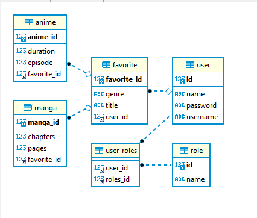
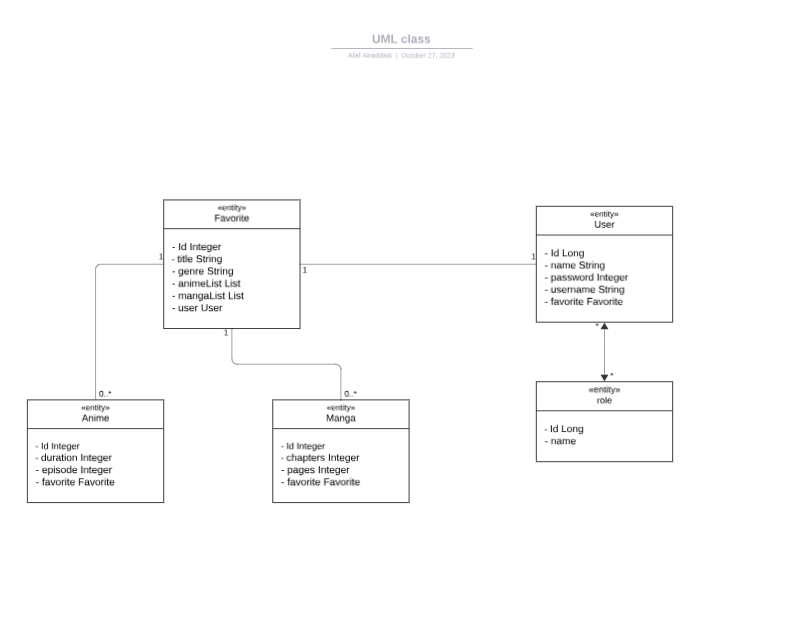

# Mid-term project
<a name="readme-top"></a>

<!-- TABLE OF CONTENTS -->
<details>
  <summary>Table of Contents</summary>
  <ol>
    <li><a href="#Description-of-the-project">Description of the project</a></li>
    <li><a href="#Class-Diagram">Class Diagram</a></li>
    <li> <a href="#Setup">Setup</a> </li>
    <li><a href="#Technologies-Used">Technologies Used</a></li>
    <li><a href="#Controllers-and-Routes-structure">Controllers and Routes structure</a></li>   
    <li><a href="#Extra-links">Extra links</a></li>
    <li><a href="#Future-Work">Future Work</a></li>
    <li><a href="#Resources">Resources</a></li>
    <li><a href="#team-members">Team members</a></li>
 
  </ol>
</details>


<!-- ABOUT THE PROJECT -->
## Description of the project

The Favorite Anime and Manga program is a software application designed for anime and manga fans to manage and keep track of their favorite anime series and manga titles. The program provides a user-friendly interface that allows users to organize anime and manga content.


<p align="right">(<a href="#readme-top">back to top</a>)</p>

## Class Diagram


| Use case                                               | ER                                                                   | Class      
|--------------------------------------------------------|----------------------------------------------------------------------|--------------------------------------------------------
|     |                           |  |


<p align="right">(<a href="#readme-top">back to top</a>)</p>


<!-- GETTING STARTED -->
## Setup
<ul>

  
## Prerequisites

**Clone the repo**
   ```sh
   git clone https://github.com/afaf99/Project-SDA-Java-Angular-.git
   ```
- [Java 17](https://www.oracle.com/java/technologies/javase-jdk17-downloads.html) (Minimum required version)
- [MySQL](https://dev.mysql.com/downloads/)
- [Postman](https://www.postman.com/downloads/)
-  Create a MySQL database and update the database configuration in `application.properties` with your database credentials:

  spring.datasource.url=jdbc:mysql://localhost:3306/favorite_list_test?createDatabaseIfNotExist=true&serverTimezone=UTC
  spring.datasource.username=your_username
  spring.datasource.password=your_password
  spring.datasource.driver-class-name=com.mysql.cj.jdbc.Driver
  spring.jpa.hibernate.ddl-auto=create-drop

###DataBase


- The project will be accessible at [http://localhost:8080](http://localhost:8080).
</ul>


## Technologies Used

This project is built using a range of technologies and tools:

- **Java Persistence API (JPA)**: Used for managing entities and database relationships.
- **Jakarta Persistence**: Annotations like `@Entity` are used for entity mapping.
- **Lombok**: Employed to reduce boilerplate code and enhance code readability.
- **Database**: MySQL.
- **APIs/Web Scraping**: Data enrichment is achieved through external data sources.
- **Spring Boot**: The Spring framework is utilized for the backend development.

These technologies work in harmony to power the system's functionality and provide a robust user experience.
<ol>
  API Testing with Postman
  <lu>

- You can test the project's APIs using [Postman](https://www.postman.com/) to ensure proper functionality and interactions.
- Detailed API endpoints and usage instructions can be found in the project's API documentation.

This project leverages Postman for thorough testing and quality assurance of its APIs.
</lu></ol>

## Controllers and Routes structure

## Usage
### End Points

| Number  |  Action         |             URL                |    HTTP Method   |    Description              |                Response                  |
|---------|-----------------|--------------------------------|------------------|-----------------------------|------------------------------------------|
|    1    |  Authenticate   |     /login                     |        GET       |  User credentials           | Successful login returns an access token |
|    2    |  show           |     /anime                     |        GET       |  Get a list of all Anime    |       List of Anime objects              |      
|    3    |  show           |     /manga                     |        GET       |  Get a list of all Manga    |       List of Manga objects              |
|    4    |  show           |     /anime/{id}                |        GET       |  Get a specific Anime by ID |       Anime object                       |
|    5    |  show           |     /manga/{id}                |        GET       |  Get a specific Manga by ID |       Manga object                       |
|    6    |  create         |     /anime                     |        POST      |  Create a new Anime         |       Created Anime object               |
|    7    |  create         |     /manga                     |        POST      |  Create a new Manga         |       Created Manga object               |
|    8    |  Update         |     /anime/{id}                |        PUT       |  Update an existing Anime   |       No content                         |
|    9    |  Update         |     /manga/{id}                |        PUT       |  Update an existing Manga   |       No content                         |
|    10   |  destroy        |     /manga/{id}                |        DELETE    |  Delete an Anime by ID      |       No content                         |
|    11   |  destroy        |     /manga/{id}                |        DELETE    |  Delete a Manga by ID       |       No content                         |


<p align="right">(<a href="#readme-top">back to top</a>)</p>

## Extra links
- [Presentation Slides](https://www.canva.com/design/DAFybp41kvI/n07TG2bpPjLIg3UDZhLlqw/edit?utm_content=DAFybp41kvI&utm_campaign=designshare&utm_medium=link2&utm_source=sharebutton)


<p align="right">(<a href="#readme-top">back to top</a>)</p>


<!-- USAGE EXAMPLES -->
## Future Work

The project has a solid foundation, and there are several potential areas for future development and improvement:


   <h3>Community Growth</h3>

- **User Engagement**: Focus on growing the user community and fostering user engagement.
- **Community Features**: Introduce community features like forums, chat, or user-generated content to enhance interaction among users.

  <h3>Scalability</h3>

- **System Optimization**: Prepare for the system's scalability as the user base expands.
- **Architecture and Database**: Optimize the system architecture and database to handle increased load gracefully.

  <h3>User-Requested Features</h3>

- **User Feedback**: Consider user feedback and requests for new features and improvements.
- **Enhanced User Experience**: Implement features that enhance user experience and align with user preferences.

  <h3>Integration with Third-Party Services</h3>

- **Streaming Platforms**: Explore the integration of third-party services, such as streaming platforms and content providers.
- **Data Enrichment**: Enhance the system's data enrichment capabilities for a more comprehensive content experience.

These future development areas can contribute to the project's growth and enhance its capabilities, providing a more comprehensive and enjoyable experience for users.


<p align="right">(<a href="#readme-top">back to top</a>)</p>


<!-- ROADMAP -->
## Resources
- If you're interested in learning more about the technologies used in this project or related concepts, consider exploring the following resources:
- [IronHack platform](https://my.ironhack.com/cohorts/64be30d2e270b9002a95e626)
- [Visual Paradigm](https://online.visual-paradigm.com/diagrams/features/uml-tool/): I built the Use Case Diagram.
- [Visual Paradigm](https://lucid.app/documents#/templates?folder_id=): I built the UML Class Diagram.
- [Dzone](https://dzone.com/articles/how-to-create-rest-api-with-spring-boot): Create a REST API with Spring Boot by DZone
- [How to do in Java](https://howtodoinjava.com/spring-boot2/testing/spring-boot-mockmvc-example/): Spring Boot MockMvc Example with @WebMvcTest

These resources provide valuable insights and knowledge that can help you further understand the technologies and principles applied in this project.

<p align="right">(<a href="#readme-top">back to top</a>)</p>


<!-- Team members -->
## Team members
- [Afaf](https://github.com/afaf99)

 
<p align="right">(<a href="#readme-top">back to top</a>)</p>


